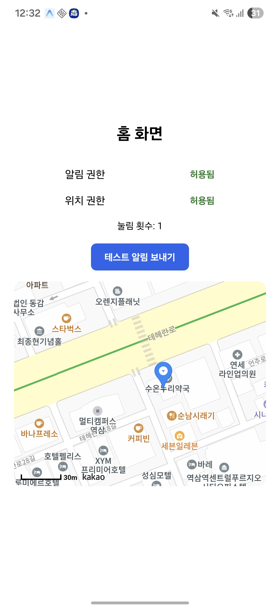

# Expo Notification & Location Demo

Expo(React Native)를 사용해 알림 권한, 위치 권한, 테스트 알림, 현재 위치 지도(Kakao Maps)를 구현한 프로젝트이다.

단순히 기능을 구현하는 것이 아니라, Expo 환경에서 발생하는 다양한 문제를 직접 분석하고 해결하는 과정에 초점을 맞췄다.

## 스크린샷

## 구현 기능

* 알림 권한 요청
* 위치 권한 요청
* 테스트 알림 발송
* 현재 위치 조회
* Kakao Maps를 이용한 현재 위치 표시

## 개발하며 해결한 문제

* Expo Go에서 `expo-notifications`가 Android에서 동작하지 않는 이유 분석
* Expo Go와 Dev Build의 차이 및 Dev Build 환경 구축
* ADB(USB/무선 디버깅)를 이용한 실기기 연결
* 네이티브 프로젝트(prebuild)와 의존성 불일치로 발생한 앱 크래시 해결
* `react-native-maps`와 `react-native-webview`의 웹 환경 호환성 문제 해결
* Kakao Maps JavaScript SDK 연동 및 WebView 디버깅
* Android 권한 요청 및 테스트 과정에서 발생한 환경 이슈 해결

## 배운 점

이번 프로젝트를 통해 단순히 Expo API를 사용하는 방법뿐 아니라, Expo와 Android 네이티브 환경이 어떻게 연결되는지, Dev Build가 왜 필요한지, 그리고 실제 개발 과정에서 발생하는 문제를 어떻게 분석하고 해결하는지를 경험했다.
